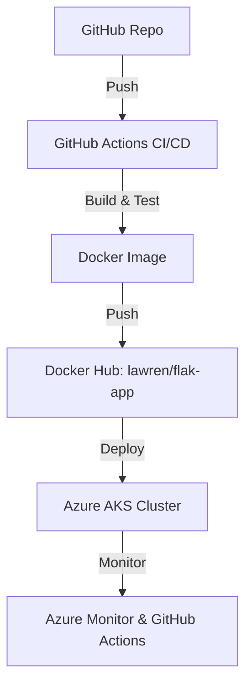

# deploy_dev


## 🚀 Project Overview

This repository provides a beginner-friendly, step-by-step guide to building, containerizing, and deploying a simple Flask application using Docker, GitHub Actions, and Azure Kubernetes Service (AKS). It is designed for first-time DevOps learners and is perfect for teaching, bootcamps, or technical presentations. The project covers the full journey from code to cloud with automation and monitoring.

---

## 🏗️ Architecture Diagram



---

## 📁 Folder Structure

```
ci-cd-pipeline/
│
├── app/                  # Flask app source code
│   ├── app.py
│   └── requirements.txt
│
├── Dockerfile            # Containerization
├── README.md             # Project documentation
├── k8s/                  # Kubernetes manifests
│   ├── deployment.yaml
│   ├── service.yaml
│   └── ingress.yaml
└── .github/workflows/
    └── deploy.yml        # GitHub Actions pipeline
```

---

## 🛠️ Step-by-Step Beginner Guide

### 1. Clone the Repository

```bash
git clone https://github.com/X-culture24/deploy_dev.git
cd deploy_dev/ci-cd-pipeline
```

### 2. Review the Flask App

- `app/app.py` contains a simple Flask web server.
- `app/requirements.txt` lists dependencies (just `flask`).

### 3. Build and Run Locally (Optional)

```bash
pip install -r app/requirements.txt
python app/app.py
# Visit http://localhost:5000
```

### 4. Dockerize the App

```bash
docker build -f Dockerfile -t lawren/flak-app:latest .
docker run -p 5000:5000 lawren/flak-app:latest
# Visit http://localhost:5000
```

### 5. Push to Docker Hub

```bash
docker login
# Enter your Docker Hub username and password
docker push lawren/flak-app:latest
```

### 6. Set Up Azure AKS (First Time Only)

#### a. Install Azure CLI

```bash
curl -sL https://aka.ms/InstallAzureCLIDeb | sudo bash
```

#### b. Login and Create Resources

```bash
az login
az group create --name myResourceGroup --location eastus
az aks create --resource-group myResourceGroup --name myAKSCluster --node-count 1 --enable-addons monitoring --generate-ssh-keys
az aks get-credentials --resource-group myResourceGroup --name myAKSCluster
```

#### c. Test Connection

```bash
kubectl get nodes
```

### 7. Deploy to Kubernetes

```bash
kubectl apply -f k8s/deployment.yaml
kubectl apply -f k8s/service.yaml
kubectl apply -f k8s/ingress.yaml  # (optional)
kubectl get svc
```
- Visit the external IP shown for your service.

### 8. Set Up GitHub Actions for CI/CD

#### a. Create Docker Hub and Azure Secrets

- Go to your GitHub repo → Settings → Secrets and variables → Actions.
- Add:
  - `DOCKERHUB_USERNAME` = lawren
  - `DOCKERHUB_TOKEN` = (your Docker Hub access token)
  - `AZURE_CREDENTIALS` = (output from Azure service principal creation)

#### b. Workflow File

- `.github/workflows/deploy.yml` is already set up to:
  - Build and push Docker image
  - Log in to Azure
  - Set AKS context
  - Deploy to Kubernetes

#### c. Trigger the Pipeline

```bash
git add .
git commit -m "Trigger CI/CD pipeline"
git push
```
- Go to the **Actions** tab on GitHub to monitor the pipeline.

---

## 📊 Monitoring the Pipeline

### GitHub Actions

- **Actions Tab:** See each step (build, push, deploy) and logs.
- **Re-run Jobs:** If a step fails, you can re-run it.
- **Notifications:** Get notified on failures or successes.

### Azure Monitor

- **Azure Portal > Monitor > Containers:**
  - View cluster health, pod logs, and set up alerts.
- **kubectl:**
  ```bash
  kubectl get pods
  kubectl logs <pod-name>
  kubectl describe svc <service-name>
  ```

---

## 🎤 Teaching & Presentation Tips

- **Show the Architecture Diagram** at the start to explain the flow.
- **Live Demo:** Run a push and show the pipeline in the Actions tab.
- **Highlight Automation:** Emphasize how code changes go from GitHub to production automatically.
- **Show Monitoring:** Open Azure Monitor and GitHub Actions logs live.
- **Encourage Hands-On:** Let learners try each step themselves.
- **Discuss Real-World Use:** Explain how this setup is used in real companies for reliable, repeatable deployments.

---

## 📚 References

- [GitHub Actions Documentation](https://docs.github.com/en/actions)
- [Azure AKS Quickstart](https://learn.microsoft.com/en-us/azure/aks/kubernetes-walkthrough-portal)
- [Azure Monitor for Containers](https://learn.microsoft.com/en-us/azure/azure-monitor/containers/container-insights-overview)
- [Docker Hub](https://hub.docker.com/)

---

## 📝 License

This repository is licensed under the [MIT License](LICENSE).

> **This project is perfect for DevOps beginners, bootcamps, and technical presentations. It covers the full journey from code to cloud, with automation and monitoring.**
